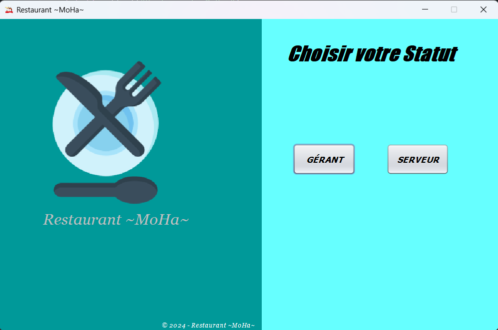
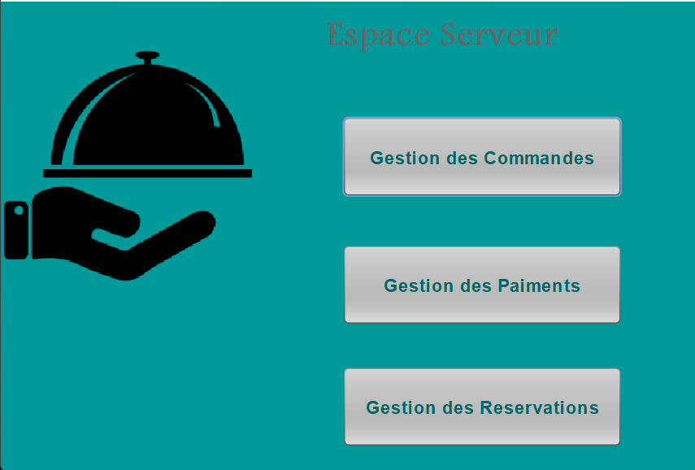
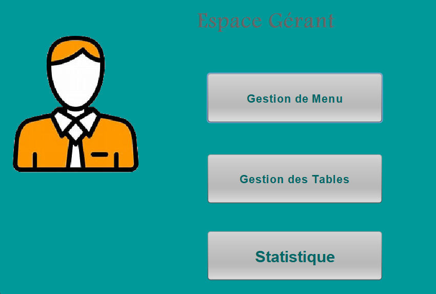

# Application de Gestion de Restaurant

## Description

Cette application Java a été développée pour simplifier la gestion des commandes, des paiements et des réservations dans un restaurant. L'objectif principal est de fournir une interface intuitive et fluide pour les serveurs et les gérants afin de faciliter la gestion quotidienne du restaurant.

## Fonctionnalités

#### Pour les Serveurs :
- Enregistrement et modification des commandes des clients.
- Gestion des réservations et attribution des tables disponibles.
- Enregistrement des paiements et génération de reçus pour chaque transaction.

#### Pour le Gérant :
- Mise à jour du menu (ajout, modification, suppression de plats).
- Gestion des tables disponibles (ajustement de configuration ou suppression).
- Accès aux statistiques importantes, telles que le chiffre d'affaires quotidien et les plats les plus commandés, pour une gestion optimisée du restaurant.

## Outils Utilisés

- **Java** : Langage de programmation principal.
- **Java Swing** : Bibliothèque utilisée pour créer l'interface graphique.
- **MySQL** : Base de données pour stocker les informations relatives aux commandes, paiements et réservations.
- **JDBC** : Interface utilisée pour connecter l'application Java à la base de données MySQL.

## Interface Utilisateur

Voici un aperçu des interfaces de l'application :

#### Page d'accueil :

*L'écran principal de l'application qui permet d'accéder aux différentes fonctionnalités.*

#### Interface Serveur :
 
*L'interface utilisée par les serveurs pour gérer les commandes et les paiements.*

#### Interface Gérant :

*L'interface utilisée par les gérants pour gérer le menu et les statistiques.*

Cette application combine une gestion efficace des opérations quotidiennes avec une interface facile à utiliser, adaptée à tous les types de personnel du restaurant.
